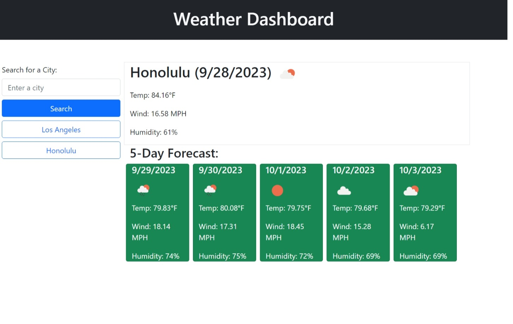

# Weather Dashboard

## Description

This app is designed to give the weather forecast for a user-inputted city.  When the app is loaded, the user can search for a city.  Upon searching, the page will populate with current day's weather and a 5-day forecast.  User's previous searched are saved locally and will populate as buttons underneath the search area.  If a user clicks on one of these buttons, the weather for that city will repopulate on the page.  

This project was created as an exercise to practice fetching from third party APIs, using local storage, and styling via Bootstrap.

Link to site: [https://adamywfong.github.io/weather-dashboard/](https://adamywfong.github.io/weather-dashboard/).

